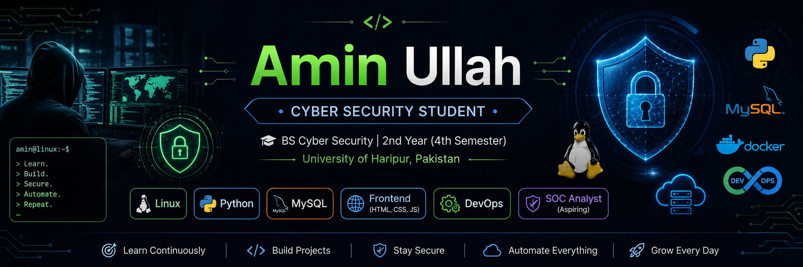

  

<h1 align="center">Hi, I'm Amin Ullah 👋</h1>

<h3 align="center">
Cyber Security Student • Python Learner • Future SOC Analyst & DevOps Engineer
</h3>

🎓 BS Cyber Security • University of Haripur, Pakistan • 2nd Year (4th Semester)

---

# 👨‍💻 About Me

I'm a **Cyber Security undergraduate** passionate about learning how secure systems are built, deployed, and defended.

I enjoy building software projects while continuously improving my **Python**, **Linux**, and **Networking** skills. My current focus is strengthening my **backend development** knowledge while preparing for a career in **Security Operations (SOC)** and **DevOps**.

I believe in **learning by building** and documenting every project on GitHub.

---

# 🎯 Current Focus

- 🔐 SOC Analyst
- 🐍 Python Backend Development
- 🐧 Linux Administration
- ⚙️ DevOps
- ☁️ Cloud Computing
- 🛡️ Cyber Security

---

# 💻 Tech Stack

### Languages

### Frontend

### Backend

### Database

### Operating System

### Tools

---

# 🚀 Featured Projects

🚍 **Transport Management System**

- C++
- OOP
- File Handling
- Admin Login

🛡️ **CyberShield**

- Cyber Security Awareness Website

🌐 **Frontend Practice**

- HTML
- CSS
- JavaScript

📖 **Git Learning**

- Git Restore
- Git Revert
- Git Ignore

---

# 📚 Currently Learning

- Python Backend Development
- Linux Administration
- MySQL
- Networking
- DevOps
- Docker
- Cloud Computing

---

# 🛣️ Learning Roadmap

✅ HTML & CSS

✅ Basic Python

✅ Basic Linux

✅ Basic MySQL

🔄 Python Backend

🔄 Networking

🔄 DevOps

🔄 Docker

🔄 CI/CD

🔄 SOC Analyst

🔄 Cloud Security

🔄 Security Automation

---

# 🔥 GitHub Streak

---

# 📊 GitHub Stats

---

# 📫 Connect With Me

📧 **Email:** aminullahcybersec@gmail.com

💼 **LinkedIn:** https://www.linkedin.com/in/amin-ullah-a3548b39b/

🌐 **GitHub:** https://github.com/amin-devsec

---

<h3 align="center">
⭐ Thanks for visiting my profile! ⭐
</h3>
